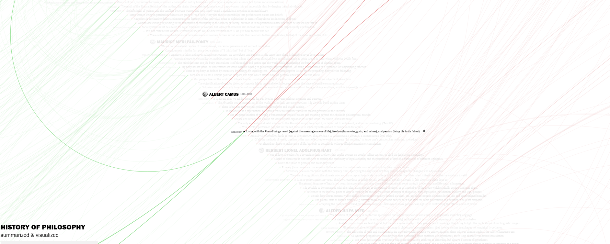

---

title: Fun ideas to do
author: Astro Learner
description: "It doesnt hurt to share some inspiration"
image:
    url: "https://docs.astro.build/assets/rays.webp"
    alt: "The Astro logo on a dark background with rainbow rays."
pubDate: 2022-07-15
tags: [ "ideas", "community"]
---

When consuming content online, social media in particular, I tend to stumble upon amazing ideas.
Alas, they get lost in the endless feed of "saved" videos.

In this post I've documented some of the fun ideas that I wanted to share and perhaps try in the future!

This is part of my bigger attempt to consume more mindfully and sort out the endless "saved" folder.

## A cold wake up call

We start this list with rather scary idea:
- An interactive wallpaper that showcases the time you are left to live

The idea is simple — put a "calendar" of your whole life onto home screen of the phone to remind yourself that there are better things to do then scrolling tiktok.

You can customise the widget to show weeks or months and it works on both android and ios:
https://thelifecalendar.com/
\<insert image here\>

## History of philosophy: A visual guide

Ever wanted to learn about philosophy more?
Or maybe you just like cool websites?

This webpage allows you to visually learn history and connections in philosophy, from 
https://www.denizcemonduygu.com/philo/

Socrates and Aristotel to Albert Camus

Be careful though - the website might not be well optimised for low end hardware

